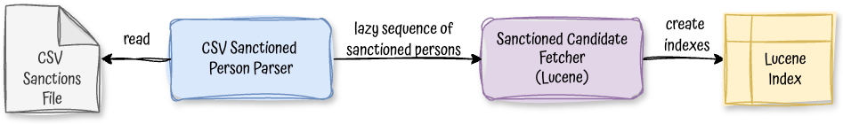
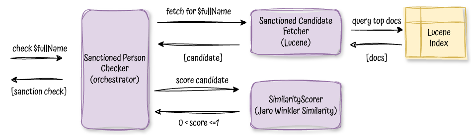
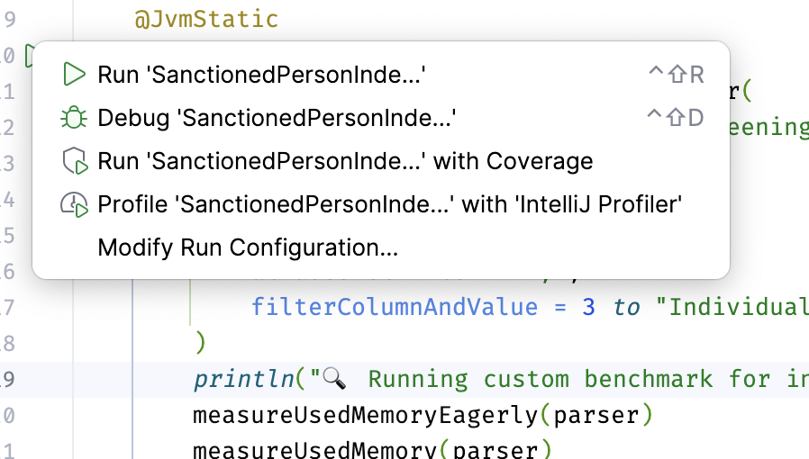

# In-memory watchlist checker

In-memory watchlist checker is a simple component that checks if a given entity is present in a watchlist.

## Architecture

Loading the list:

    

Using the list:

    

## Watchlist sources

🌐  Consolidated Screening List (U.S. Dept. of Commerce)

URL: 🔗 https://www.trade.gov/consolidated-screening-list

## Tests

- Functional tests: Check [here](/src/test/kotlin/watchlist/)
- Performance tests: Check [here](/src/jmh/kotlin/benchmark/SanctionedPersonUsageBenchmark.kt) run it with `./gradlew jmh`
- Profiling tests: Check [here](/src/jmh/kotlin/benchmark/SanctionedPersonIndexMemoryBenchmark.kt), run it with any profiler tool, 
such as intellij one 

    

